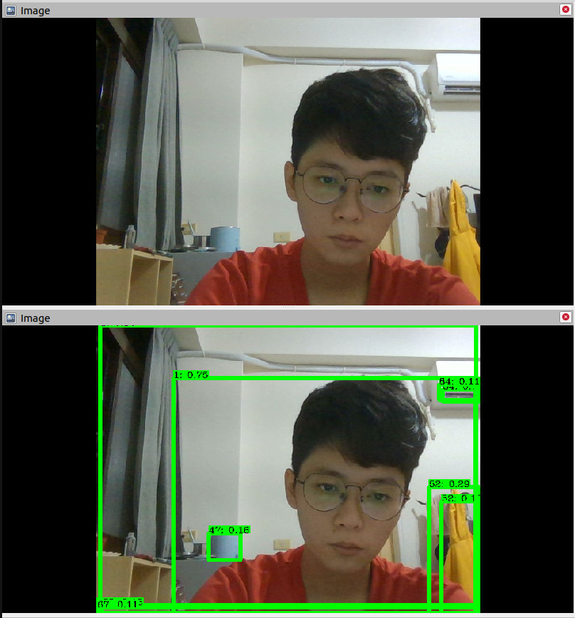

# vitis-ai-socket-inference

This is an interface for bridging ROS with `Vitis AI Library`, which run on Kria KV260 Vision AI Starter Kit in PetaLinux.

For `efficientdet_d2`, the model we use, please see the official [repo](https://github.com/Xilinx/Vitis-AI/tree/master/examples/Vitis-AI-Library/samples/efficientdet_d2).

* [Server](server/socket_inference.cpp)
One KV260, there is a socket server programming in C++, which receives socket package of image, runs DPU inference and return the prediction results.

* [Client](client/catkin_ws/src/efficientdet_client/src/efficientdet_client.py)
One another machine with ubuntu & ROS, there is a socket client programming in Python, which is a ROS wrapper for subscribing CompressedImage topic, requesting service from the server and publishing the responded result.

